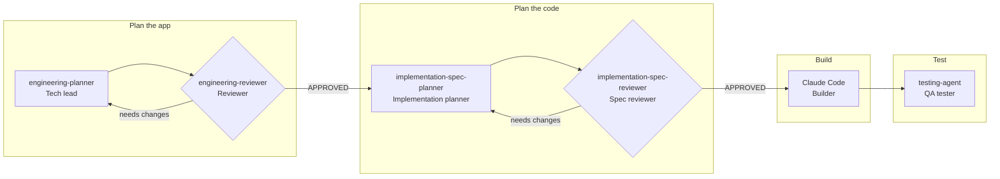

# Plan → Build → Remember → Secure → Ship

### 🔗 **Live app: [vibha-contractiq-project.netlify.app](https://vibha-contractiq-project.netlify.app)**

How I built **ContractIQ**, an AI contract-review app, with Claude Code: from idea to live URL.

**Built with:** Next.js 14 · TypeScript · Tailwind CSS · Supabase · Claude API · Claude Code CLI · Netlify · Microsoft Fabric

> **Interactive version:** open `index.html`, or turn on GitHub Pages for this repo (Settings → Pages → Deploy from branch → `main` / root) to get a clickable link.

## My AI team

Instead of asking one Claude to do everything, I created **5 subagents**, each with **one job**, like people on a real team. They hand work to each other in a fixed order. That order is the **workflow** (also called orchestration).

1. **One job per agent**
2. **Nothing moves on until a reviewer says 👍 APPROVED**
3. **Each agent's output is the next one's input**

| Agent | Role | Job | Produces |
|---|---|---|---|
| `engineering-planner` | Tech lead | Reads the PRD and writes the architecture plan; checks its own work until nothing is missing | `engineering-doc.md` |
| `engineering-reviewer` | Reviewer | Compares the plan to the PRD line by line; approves it or sends back exact fixes | 👍 APPROVED |
| `implementation-spec-planner` | Implementation planner | Turns the approved plan into file-by-file build instructions | `docs/implementation/` |
| `implementation-spec-reviewer` | Spec reviewer | Checks the specs against the PRD and the plan; approves or sends back | 👍 APPROVED |
| `testing-agent` | QA tester | Runs 10 key checks (upload, sign-in, users can't see each other's data…) and needs evidence for each pass | `testing-report.md` ✅ ❌ ⚠️ |

All agents are saved as files in `.claude/agents/` and have `memory: project`, so they remember past decisions between runs.
**Skill = how** the work is done · **Agent = who** does it · **Workflow = what** happens next.

---

## Plan
*Write the docs before any code*

| How | What | Claude concepts |
|---|---|---|
| 1. Fork and clone the starter repo, then open it in VS Code 2. Read the PRD, the design system and the 5 skills 3. Create subagents: planner, reviewer, spec planner, spec reviewer and tester 4. Run `engineering-planner`; the reviewer approves the plan | ✅ `CLAUDE.md`, PRD and `design.md` in place ✅ Five focused agents with project memory ✅ An approved `engineering-doc.md` | CLAUDE.md · Skills / slash commands · SKILL.md structure (Purpose → Inputs → Instructions → Output) · Subagents · Agent delegation · Project memory · Stage gates · PRD as source of truth |

## Build
*Give Claude exact context*

| How | What | Claude concepts |
|---|---|---|
| 1. Create a Supabase project and add the credentials 2. Scaffold Next.js using an `@skill` reference 3. Have the spec agent turn the doc into specs 4. Implement from the engineering doc, then load the SQL schema | ✅ Live Supabase database with Row Level Security ✅ Next.js 14 app with the design system built in ✅ File-by-file implementation specs ✅ App running on localhost | `@` file references · Subagent invocation · Specs and docs as build context · Row Level Security · Env var safety · Diagnose-and-fix prompts |

## Remember
*Plan memory on purpose*

| How | What | Claude concepts |
|---|---|---|
| 1. Classify each question 2. Load chat history from Supabase before each call 3. Save every message exactly once 4. Cite the source in every answer | ✅ In-context, multi-turn memory ✅ Persistent memory that survives refreshes ✅ Lean calls that send only the context needed ✅ Answers that cite `[Page X]` | Stateless Claude API · `messages[]` array · Persistent memory · Query classification |

## Secure
*Scan and fix before shipping*

| How | What | Claude concepts |
|---|---|---|
| 1. Run `@skills/security-fix/SKILL.md` 2. Check that every fix works 3. Run `testing-agent` against the requirements | ✅ No hardcoded secrets ✅ Protected API routes ✅ Safe error messages and security headers ✅ A `.gitignore` that keeps env files out of git | Security-scan skill · `NEXT_PUBLIC_` rule · Iterative debugging · Testing subagent |

## Ship
*git push, then it deploys*

| How | What | Claude concepts |
|---|---|---|
| 1. Push the code to GitHub 2. Connect Netlify and set up the build 3. Add env vars and deploy 4. Point `NEXTAUTH_URL` at the live URL and redeploy | ✅ A public, live URL ✅ Automatic redeploy on every `git push` ✅ Secrets encrypted in Netlify ✅ Login redirects that work in production | Production debugging · Descriptive prompting |

---

## Going deeper

### Structure: make LLM output reliable
**How:** Vague prompt → Better prompt → Few-shot + XML → JSON schema → Tool use → `strict: true` → Tool loop → `is_error`
**What:** Contract fields extracted the same way every run, saved by a tool, and failures reported back to Claude
**Concepts:** Prompt engineering · Structured outputs · Tool use · Strict schemas · Tool errors

### Connect: turn a document into a graph
**How:** Contract PDF → Notebook → Lakehouse tables → Nodes + edges → GQL query
**What:** `Party —PARTY_TO→ Contract —CONTAINS→ Clause`, which you can query in Microsoft Fabric
**Concepts:** Nodes · Edges · IDs connect records · GQL

---

## Remember this

| | |
|---|---|
| **Skill = HOW · Agent = WHO** | An agent is the engineer; a skill is the playbook it follows |
| **CLAUDE.md is read first** | It holds the stage, the rules, and what Claude may do |
| **Point, don't paste** | `@file` references to the PRD, docs and skills |
| **The API is stateless** | Memory is something you build |
| **`NEXT_PUBLIC_` = public** | Never put a secret behind it |
| **`tool_use` ≠ executed** | Your code runs the tool |
